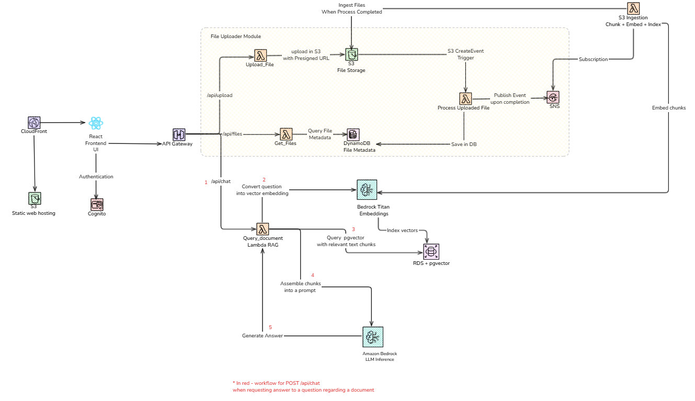
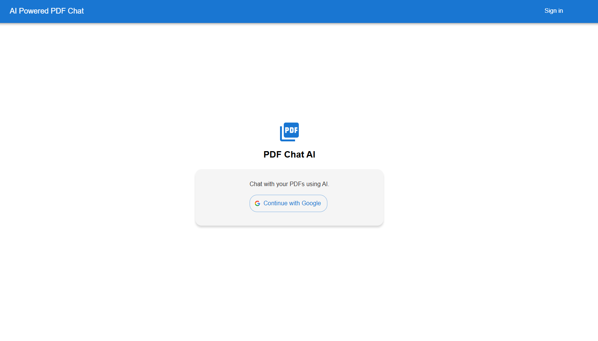
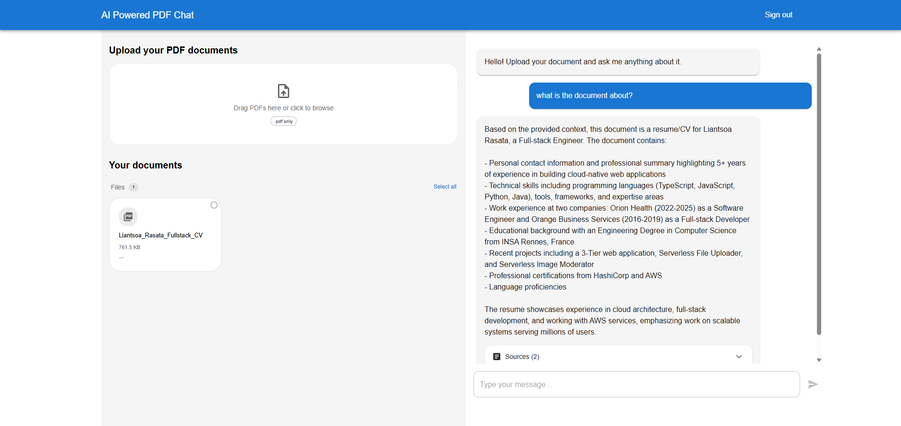

# AI Powered Document Chat App


A cloud-native application that allows users to chat with their PDF documents using AI. Built with AWS Bedrock, RDS PostgreSQL + pgvector, and React. Uses **Retrieval-Augmented Generation (RAG)** to answer questions grounded in the user's own documents.

## What is RAG?

**Retrieval-Augmented Generation (RAG)** is a technique that combines a vector search engine with a large language model (LLM). Instead of relying solely on the LLM's pre-trained knowledge, RAG first retrieves relevant passages from a document store and feeds them as context to the LLM before generating an answer.

**Pros:**
- Answers are grounded in your actual documents, reducing hallucination
- Works with private or domain-specific content the LLM was never trained on
- Easy to update the knowledge base without retraining the model
- Source citations are traceable

**Cons:**
- Answer quality depends heavily on chunking and retrieval quality
- Adds latency (embedding + vector search before LLM call)
- Irrelevant chunks can mislead the LLM if retrieval is poor
- Requires maintaining a vector database alongside the document store

### How RAG works in this project

1. **Ingestion** 

   When a document is uploaded to S3, the `s3-ingestion` Lambda extracts the text, splits it into overlapping chunks (~500 words), and calls Amazon Titan Embeddings to convert each chunk into a 1536-dimensional vector. The vectors are stored alongside the text in RDS PostgreSQL using the `pgvector` extension.

2. **Query**

   When a user asks a question, the `query-document` Lambda embeds the question with the same Titan model, then runs a cosine similarity search (`<=>` operator) against the `document_chunks` table in PostgreSQL to find the most relevant chunks. Results can be scoped to a specific document or to all documents belonging to the user.

3. **Generation**

   The top matching chunks are assembled into a context prompt and sent to Anthropic Claude 4 on AWS Bedrock. Claude answers the question using only the retrieved context, then the response is returned to the frontend with source citations.

## Features

- **Document Upload**: Tested with PDFs containing text. ⚠️ Not multimodal yet (images, tables, etc.)
- **AI-Powered Chat**: Ask questions about your documents using natural language
- **Semantic Search**: Vector similarity search with Amazon Titan embeddings (for text) and pgvector
- **LLM Integration**: Powered by Anthropic Claude 4 on AWS Bedrock
- **Secure Authentication**: AWS Cognito with Google OAuth
- **Real-time Interface**: Modern React UI with Material-UI
- **Serverless Architecture**: Auto-scaling, pay-per-use infrastructure
- **Infrastructure as Code**: Complete Terraform deployment

## Architecture



**Frontend:**
- React (Vite) app with TypeScript
- Material-UI components
- Hosted on S3 + CloudFront

 

**Backend:**
- **API Gateway**: RESTful endpoints with JWT authentication
- **Lambda Functions**:
  - `upload` - Generate presigned S3 URLs
  - `get-files` - Query DynamoDB for user documents
  - `query-document` - RAG chat handler with Bedrock integration
  - `s3-ingestion` - Extract text, create embeddings, index to pgvector
- **Storage**:
  - S3 for document storage
  - DynamoDB for file metadata
  - RDS PostgreSQL + pgvector for vector search
- **Networking**:
  - Lambda and RDS run inside a private VPC
  - VPC Interface Endpoints for Bedrock, Secrets Manager, SNS (no NAT Gateway)
  - VPC Gateway Endpoints for S3 and DynamoDB (free)
- **AI/ML**:
  - Amazon Titan Embeddings for vectorisation
  - Anthropic Claude 4 for chat responses

**Authentication:**
- AWS Cognito User Pool with Google IdP

## How It Works

1. **User uploads a document** → Stored in S3
2. **S3 event triggers ingestion Lambda** → Extracts text, chunks it
3. **Text chunks embedded** → Using Amazon Titan Embeddings
4. **Chunks indexed** → Stored in RDS PostgreSQL (`document_chunks` table) with pgvector
5. **User asks a question** → Question embedded with Titan
6. **Vector search** → pgvector cosine similarity finds the most relevant chunks
7. **LLM generates answer** → Claude 4 uses retrieved context to respond
8. **User receives answer** → With source citations and relevance scores

## Repository Structure

```
.
├── frontend/
│   └── docu-chat-ai/          # React TypeScript app
├── terraform/
│   ├── environments/          # Variable files
│   │   ├── staging.tfvars.example
│   │   └── prod.tfvars.example
│   └── layers/
│       ├── backend/           # Lambda, API Gateway, RDS pgvector
│       │   ├── main.tf
│       │   ├── locals.tf      # Lambda configurations
│       │   ├── modules/
│       │   │   ├── api_gateway/       
│       │   │   ├── lambda_function/   
│       │   │   ├── route53/
│       │   │   └── rds/       # VPC, RDS PostgreSQL, VPC endpoints
│       │   └── src/
│       │       └── lambda_functions/
│       │           ├── query_document/  # RAG chat handler
│       │           └── s3_ingestion/    # Document processing + embedding
│       ├── cognito/           # Authentication
│       ├── secrets/           # Secrets Manager
│       └── frontend/          # S3 + CloudFront
└── DEPLOYMENT.md              # Deployment and configuration guide
```

## API Endpoints

- `POST /api/chat` - Send a question, get AI-generated answer (optionally scoped to a document)
- `GET /api/files` - List user's uploaded documents
- `GET /api/upload` - Get a presigned S3 URL for uploading

All endpoints require JWT authentication via Cognito.

## Security

- JWT authentication via Cognito
- Encrypted at rest (S3, DynamoDB, RDS storage encryption)
- IAM least privilege for Lambda roles
- RDS in private VPC subnets — not publicly accessible
- RDS credentials stored in Secrets Manager, fetched at runtime
- Presigned URLs with expiration
- No hardcoded credentials

## Why these choices?

### Why RAG instead of fine-tuning?

Fine-tuning a model on your documents is expensive, slow, and requires retraining every time the knowledge base changes. 

RAG lets you update the document store at any time without touching the model. It also gives you traceable citations. 
You always know which passage the answer came from. For a document chat use case where content changes over-time and accuracy matters, RAG is the right fit.

### Why RDS PostgreSQL + pgvector instead of OpenSearch Serverless?

OpenSearch Serverless was the original choice for vector search. However, it has a minimum cost of ~$700/month regardless of 
usage — two always-on Indexing Compute Units and two Search Compute Units are required even for a single index with 
zero traffic. That made it unaffordable and overkill for POC.

RDS PostgreSQL with the `pgvector` extension provides the same cosine similarity search capability at a fraction of the 
cost (~$13/month for a `db.t4g.micro` instance). The trade-off is that it's not serverless — the instance runs 24/7 — but 
for this use case the cost difference is so significant (~50x cheaper) that it is clearly the right choice. 
For production with high query volume, you could scale up the RDS instance or migrate to Aurora PostgreSQL which also 
supports pgvector.

## Production Readiness TODOs

The current setup works for staging and demos. Before going to production:

**Reliability & Error Handling**
- [ ] Add a Dead Letter Queue (DLQ) to the SNS → S3 Ingestion Lambda subscription to catch failed ingestion events
- [ ] Add retry logic with exponential backoff on Bedrock API calls (throttling)
- [ ] Handle partial ingestion failures — currently a crash mid-document leaves orphaned chunks

**Scalability**
- [ ] Upgrade RDS to a multi-AZ deployment for high availability (`multi_az = true` already conditioned on `prod` environment)

**Security**
- [ ] Enable AWS WAF on CloudFront and API Gateway
- [ ] Enforce MFA for Cognito users
- [ ] Enable CloudTrail for full API audit logging
- [ ] Rotate RDS credentials automatically via Secrets Manager rotation

**RAG Quality**
- [ ] Build a golden Q&A dataset: for each test document, write questions and expected answers manually (based on your own reading of the document), run them through the system, and human-review the outputs — this validates retrieval quality, chunk relevance scores, and answer accuracy without relying on an LLM judge

**Content Filtering**
- [ ] with Bedrock Guardrails for PII removal, text filtering, word filtering, profanities etc...

**Observability**
- [ ] Set up CloudWatch Alarms for Lambda error rates, RDS connection count, and API Gateway 5xx
- [ ] Create a CloudWatch Dashboard for the key metrics

**Cost**
- [ ] Use reserved instances for RDS in production (up to 40% savings)
- [ ] Set S3 lifecycle rules to archive or delete old document uploads

## License

MIT License – see LICENSE file for details

## Acknowledgments

Built with:
- [AWS Bedrock](https://aws.amazon.com/bedrock/)
- [RDS PostgreSQL + pgvector](https://github.com/pgvector/pgvector)
- [React](https://react.dev/)
- [Vite](https://vitejs.dev/)
- [Material-UI](https://mui.com/)
- [Terraform](https://www.terraform.io/)
- [Infracodebase](https://infracodebase.com/)